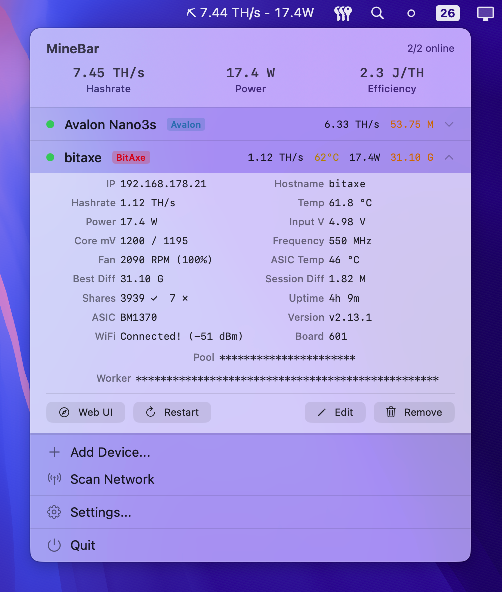
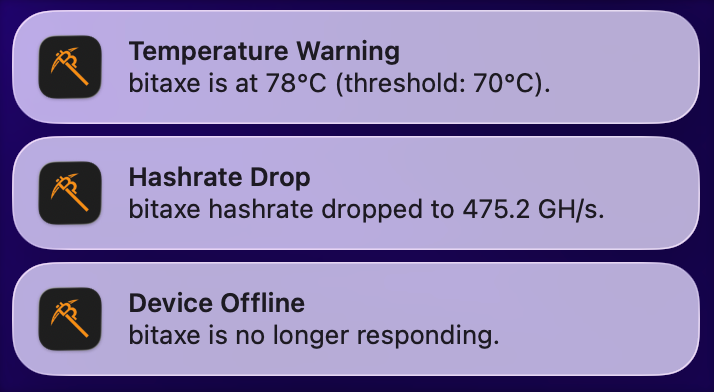

# MineBar

A macOS menu bar app for monitoring your Bitcoin miners. Supports BitAxe, NerdAxe, and Canaan Avalon devices on your local network.

## Screenshots





## Features

- Live hashrate, temperature, and power in the menu bar
- Auto-discovery via local network scan (scans your /24 subnet)
- Per-device detail view with pool info, shares, uptime, best difficulty, and more
- All-time best difficulty tracking that persists across reboots
- Notifications for offline devices, hashrate drops, and temperature warnings
- Restart devices and open their web UI directly from the menu bar
- No data ever leaves your local network

## Tested Devices

- BitAxe
- NerdAxe
- Canaan Avalon

Other devices using AxeOS or CGMiner may work too.

## Install

**Homebrew:**

```bash
brew install --cask ciruz/tap/minebar
```

**Manual:**

1. Download the latest `.zip` from [Releases](https://github.com/ciruz/minebar/releases)
2. Unzip and move `MineBar.app` to `/Applications`
3. Open normally, the app is signed and notarized

## Permissions

- **Local Network Access** - required to reach your miners over the LAN. Without this, nothing works.
- **Notifications** (optional) - alerts for offline devices, hashrate drops, and temperature warnings.

## Adding Devices

**Network Scan:** Click **Scan Network** in the popover. MineBar scans your /24 subnet and finds supported devices automatically.

**Manual:** Click **Add Device...** and enter the device type, name, and IP address.

## Settings

Polling interval (5s - 60s), launch at login, and notification thresholds are in **Settings...** in the popover.

## Menu Bar

The menu bar shows a pickaxe icon with your fleet's total hashrate and power:

```
⛏ 1.2 TH/s | 14.6W
```

You can toggle which values appear in the status bar (Hashrate, Power) in Settings.

Click to open the popover with per-device stats. Click a device row for detailed info including pool, shares, uptime, ASIC model, firmware, and more.

## Build from Source

Requires macOS 14.0+ and Xcode.

```
git clone https://github.com/ciruz/minebar.git
cd minebar
open MineBar/MineBar.xcodeproj
```

Sparkle is added via Swift Package Manager and resolves automatically.

## License

MIT

## Donate

If MineBar is useful to you, support development:

**BTC:** `bc1qfvmlkev4hp3m30r42yyklln7lwhc6kfv3lqu2c`
